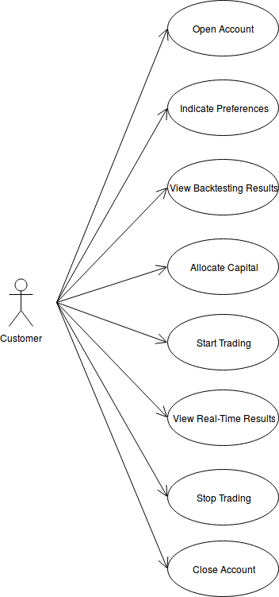
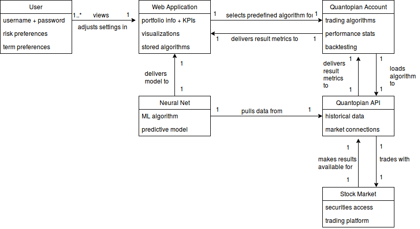

# Requirements

## Stakeholder Interviews
We interviewed Professor Bloomberg and our TA Priyanka to glean some information about what an average user would like to get out of our system. A couple of major points: first, we should have as many relevant parameters as possible for users to modify (previously described in our requirements doc as preferences) that will affect the way the algorithm operates. For example, does the customer prefer high-risk investments? Does the customer want to make profits over a few days, weeks, months, or years?What sector does the customer prefer? Based on the customer's answers to these questions, we will modify the algorithm to be used in trading. Additionally, the web application will display a few key metrics and visualizations for the customer to view. They will be able to see their portfolio's performance vs. an index fund (such as the S&P 500), as well as how each stock in their portfolio is performing relative to its sector (ex: AMZN vs. Tech Sector on a graph). Users would also like to see some basic analytics and metrics about the performance of their portfolio. There should also be secure account login given that the user may choose to invest real money. 

## End-User Observation
* Alexa Livington is a 20 years old college student, sophomore, econs major, He heard about stocks and equity for the first time in lectures. He wants to invest using his own saving and build a investment portfolio. However, he understands too little about the market and sector and doesn't know what kind of stock he is going to invest in. He started to buy in small shares of Gopro and Snap Chat stocks as he thought that they are cool things among the young people and should have a promising future. However, he did not any knowledge about the financial model of these two companies, and terrible quarterly result sent these two stocks 20% lower in 2 weeks. He was panic and sold all his stock all very low prices and failed to chase the rebound. He was looking for some software that can help him identify the risk in investment and help him in choosing the right stock that can minimize the risk for investment.

* Grace Yolanda is a 55 year old dentist who has significant amout of saving, she had been investing in some bank issued mutual funds and ETFs and she would like to invest some money to ride this bull market but yet she wanted to prevent risky stocks for her retirement. She had some understanding about the market, however she was busy with her job and did not have time to constantly monitoring the stocks. She was looking for an trading app that can help her manage her money in the stock market without her constant attention.

## Use Cases 
We anticipate that the sole actor of the system will be the user / customer, since there will not be any admin roles besides the developers themselves. The primary and sole use case of this product that we plan to develop and optimize for is to automate trading with the stock market based on individual preferences. Below is an outline of this use case:

Title: Trading Securities  
Actor: Customer

Scenario: Customer creates an account with a username and password for secure login in the future. Customer answers a series of questions regarding her investment preferences. This can include whether she would like to invest over a long or short period of time, approximately how much capital she plans to allocate, and the level of risk she is willing to take on. The system evaluates her responses using a predefined decision model and selects an algorithm. Customer views visualizations and performance results of the algorithm based on backtesting. Customer decides on whether to allocate real capital to the algorithm. System trades with the user's capital using the selected algorithm and displays results on the web interface. Customer views trading progress and key performance indicators over time through the web interface. Customer terminates trading whenever she desires.  

Below is a diagram of this use case.

## Domain Model

